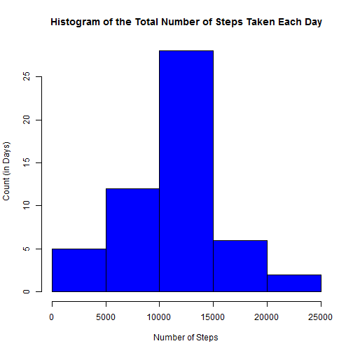
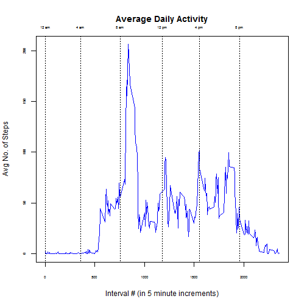
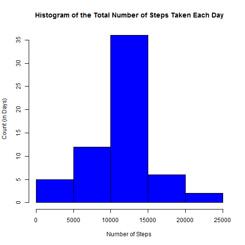
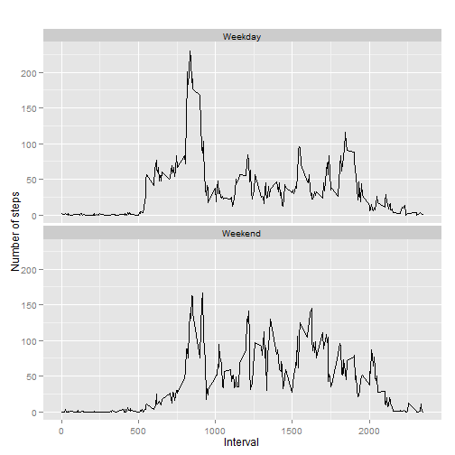

# Reproducible Research: Peer Assessment 1

### Overview

This analysis makes use of data from a personal activity monitoring
device. The device collected data at 5 minute intervals throughout the
day. The data consists of two months of data from an anonymous
individual collected during the months of October and November, 2012
and include the number of steps taken in 5 minute intervals each day.

This document contains the processing code and analytic data generated to summarize the data and create exploratory and summary graphs. 

Additional information is available in this repo, and includes:

+ the Project description in the README file
+ the Data file description in the README file
+ the raw Data file


## Loading and preprocessing the data


Unzip the data file if the unzipped data file is not already in the working directory.  Read the data.


```r
fileName <- c("activity.csv")
if (!fileName %in% dir()){
  unzip(fileName)
} 
stepData <- read.csv(fileName) 
```

Load the r libraries required for processing.


```r
library(plyr)
library(ggplot2)
```

Verify that the file description is accurate:

+ NAs occur in the steps variable only

+ there are no negative values in the steps and interval variable


```r
summary(stepData)
```

```
##      steps               date          interval   
##  Min.   :  0.0   2012-10-01:  288   Min.   :   0  
##  1st Qu.:  0.0   2012-10-02:  288   1st Qu.: 589  
##  Median :  0.0   2012-10-03:  288   Median :1178  
##  Mean   : 37.4   2012-10-04:  288   Mean   :1178  
##  3rd Qu.: 12.0   2012-10-05:  288   3rd Qu.:1766  
##  Max.   :806.0   2012-10-06:  288   Max.   :2355  
##  NA's   :2304    (Other)   :15840
```

Clean the data by removing NA values.


```r
cleanData <- stepData[!is.na(stepData$steps),]
```

Summarize the cleaned data and see what it looks like.


```r
totData <- ddply(cleanData,.(as.Date(date)), summarize, Steps = sum(steps))
hist(totData$Steps, col = "blue",
     main ="Histogram of the Total Number of Steps Taken Each Day",
     xlab = "Number of Steps", ylab = "Count (in Days)")
```

 


## What is mean total number of steps taken per day?


Compute the mean and median using the clean data.


```r
sumData <- summary(totData$Steps,digits =  5)
sumData["Mean"]
```

```
##  Mean 
## 10766
```

```r
sumData["Median"]
```

```
## Median 
##  10765
```


## What is the average daily activity pattern?


Compute the averages for each 5 minute interval and look at the pattern via a line chart.  Add the clock time to the chart to get an idea of when the interval is occuring.


```r
avgData <- ddply(cleanData,.(interval), summarize, AvgSteps = mean(steps))

plot(avgData$interval,avgData$AvgSteps,type = "l", col = "blue",
     main = "Average Daily Activity",
     xlab = "Interval # (in 5 minute increments)",
     ylab = "Avg No. of Steps", cex.axis = 0.5)
     axis(side=3,at=c(0,355,755,1178,1555,1955), 
     labels = c("12 am","4 am","8 am","12 pm","4 pm","8 pm"), padj = 1,
     lty = 3, tck = 1, cex.axis = 0.5)
```

 

#####  Where is the maximum interval and what is its value?


```r
sumavgData <- summary(avgData$AvgSteps)
maxAvg <- sumavgData["Max."]
maxInterval <- avgData[which.max(avgData[,2]),1]
```

The 5 minute interval containing the maximum number of steps is 835.  The average number of steps at this interval is 206.


## Imputing missing values


Determine how many missing values are contained in the data.


```r
numNAs <- length(which(is.na(stepData$steps)))
```

There are 2304 missing values in the raw data file.

##### Decide how to handle missing values.

In this analysis, missing values will be replaced with the mean steps calculated for the 5 minute interval. 

Make a copy of the raw data.  Create a vector containing the location of the NA values.  Then fill in the NA values with the mean for the corresponding 5 minute interval.  Several lines of code are used (instead of a single line of code) to enhance comprehension.


```r
##  Copy the raw data
revstepData <- stepData

##  Find where the missing values occur 
locNAs <- which(is.na(stepData$steps))

for (i in 1:numNAs) {
    intnum <- revstepData[locNAs[i],3]      ## Go to location/Get interval number
    avgintval <- avgData[match(intnum,avgData$interval),2]  ## Get avg step @ int
    revstepData[locNAs[i],1] <- avgintval   ##  Fill in the avg step
}  ## end for
```

See what impact the imputed values have on the average daily activity pattern.  Summarize the revised data and look at it via a histogram.


```r
##  Sum the total number of steps each day with the revised data (including avgs)
totrevData <- ddply(revstepData,.(as.Date(date)), summarize, Steps = sum(steps))
hist(totrevData$Steps, col = "blue", main ="Histogram of the Total Number of Steps Taken Each Day",
     xlab = "Number of Steps", ylab = "Count (in Days)")
```

 

Compute the mean and the median using the data with imputed values.

```r
##  Find the mean and median
sumrevData <- summary(totrevData$Steps, digits = 5)
sumrevData["Mean"]
```

```
##  Mean 
## 10766
```

```r
sumrevData["Median"]
```

```
## Median 
##  10766
```


##### Compare the means of the data with NAs removed and the data with imputed values

The mean of the data with NAs removed is 10766.  
The mean of the data with imputed values is 10766.

The means of the data are the same when the missing values are generated by using the average number of steps at the corresponding interval.


## Are there differences in activity patterns between weekdays and weekends?

Summarize and plot the step activity patterns for the weekdays and the weekends (using the data with imputed values)


```r
##  Assign "weekday" or "weekend" to the data based on the date; add a new
##  column containing the value
weekEnd <- c("Saturday","Sunday")
revstepData$wkdayID <- as.factor(ifelse(weekdays(as.Date(revstepData$date)) %in%
                                 weekEnd, "Weekend", "Weekday"))

##  find the average number of steps taken by interval by weekend/weekday
avgrevData <- ddply(revstepData,.(interval,wkdayID), summarize,
                    AvgSteps = mean(steps))

##  plot the data
qplot(interval, AvgSteps, data=avgrevData, geom=c("line"), xlab="Interval", 
      ylab="Number of steps", main="") + facet_wrap(~ wkdayID, ncol=1)
```

 

A comparison of weekday to weekend data shows:

*   weekend activity starts to increase slightly later in the morning
*   weekday activity drops significantly after its peak while weekend activity continues at a steady rate throughout the day
*   weekend activity continues later in the day than weekday activity


###  End of this Analysis
